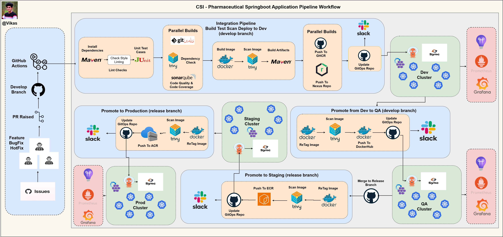

# Enterprise-Grade DevSecOps Platform for Pharmaceutical Java Application

## Project Overview

This repository is part of a comprehensive enterprise-grade DevSecOps platform designed to deploy a Java-based pharmaceutical application on Azure using cloud-native best practices. The goal is to replicate real-world enterprise deployment workflows by integrating modern CI/CD, GitOps, security scanning, infrastructure automation, and monitoring tools into a unified, scalable, and secure platform.

---

## Architecture & Setup Overview

The platform follows an industry-standard **GitFlow branching strategy** — including **develop, release, main, feature** with support for multiple environments — **development (dev), quality assurance (qa), staging (pre prod), production (prod)** — along with disaster recovery (DR) and optional user acceptance testing (UAT) branches for major features. 

The deployment lifecycle includes:
- Automated infrastructure provisioning via Terraform
- Continuous Integration (CI) pipelines with Maven, unit testing, Trivy(filesystem and Image) and static/dynamic security scanning
- Container image management and artifact storage
- Pull Request (PR) mechanism to update Docker image tags in the GitOps repository, enabling controlled, auditable deployments 
- GitOps-driven Continuous Deployment (CD) with ArgoCD and Kustomize overlays
- Canary deployment strategy for safe progressive rollouts
- Enterprise-grade monitoring and observability at both cluster and application levels
- Notification and alerting integration for real-time feedback

For details on the **branching strategy** and **pipeline architecture**, refer to the documentation: 
 
👉 [View Docs »](https://github.com/Vikas-Prince/csi-devops-pharma-app/tree/develop/docs)

---

## Repository Structure

## 📁 Repository Structure

To maintain clear separation of concerns, the platform is divided into **three distinct repositories**:

| Repository Name               | Purpose                                                                                                                                           | Maintained By                  | Repository Link                                                                 |
|------------------------------|---------------------------------------------------------------------------------------------------------------------------------------------------|-------------------------------|----------------------------------------------------------------------------------|
| `csi-devops-pharma-app`      | Java application source code with Maven build and unit tests, GitHub Actions CI pipeline, security scanning, containerization, and artifact publishing | Application Development Team (Vikas) | [🔗 GitHub](https://github.com/Vikas-Prince/csi-devops-pharma-app)             |
| `csi-pharma-app-infra`       | Infrastructure as Code (IaC) using Terraform for provisioning Azure resources (AKS, ACR, Key Vault, Networking, etc.) with modular and environment-specific configurations | DevOps / Infrastructure Team (Vikas) | [🔗 GitHub](https://github.com/Vikas-Prince/csi-pharma-app-infra)              |
| `csi-pharma-app-gitops`      | GitOps repository containing ArgoCD Application manifests, Kubernetes deployment configurations using Kustomize base and overlays per environment, and Helm charts for monitoring stack deployment | Platform / DevOps Team (Vikas) | [🔗 GitHub](https://github.com/Vikas-Prince/csi-pharma-app-gitops)             |

---

## Tools and Technologies

### Continuous Integration & Delivery
- **GitHub Actions**: Automated CI/CD pipelines
- **Maven**: Build automation for Java application
- **JUnit**: Unit testing framework
- **Docker**: Container image creation and management
- **Azure Container Registry (ACR)**: Private container registry
- **Nexus Repository**: Artifact repository for binaries and dependencies

### Security & Compliance (DevSecOps)
- **SonarQube**: Static Application Security Testing (SAST)
- **OWASP ZAP**: Dynamic Application Security Testing (DAST)
- **Trivy**: Container image vulnerability scanning
- **Slack Integration**: Real-time build and deployment notifications

### Infrastructure & Provisioning
- **Terraform**: Infrastructure as Code with modular design and environment isolation
- **Azure Services**: AKS (Kubernetes), ACR, Key Vault, Application Insights, Virtual Networks, Blob Storage (remote state backend)

### Deployment & GitOps
- **ArgoCD**: GitOps continuous deployment controller
- **Kustomize**: Kubernetes manifest templating with base and environment overlays
- **Canary Deployments**: Progressive rollout strategy for safer releases
- **Hub-Spoke GitOps Model**: Scalable, team-oriented deployment architecture

### Monitoring & Observability
- **Prometheus & Grafana**: Cluster-level monitoring and dashboards (deployed via Helm charts)
- **Azure Application Insights**: Application-level telemetry and diagnostics

---

## High-Level Workflow Summary

1. **Development**: Developers work on feature branches following GitFlow strategy.
2. **CI Pipeline**: Code changes trigger GitHub Actions for build, test, security scans, and container image builds.
3. **Artifact Publishing**: Docker images are pushed to Azure Container Registry; binaries are stored in Nexus.
4. **GitOps Deployment**: The CI pipeline updates the GitOps repo with new image tags, which ArgoCD automatically syncs to AKS clusters based on environment overlays.
5. **Progressive Rollouts**: Canary deployment strategy ensures safe deployment through dev, qa, staging, and production environments.
6. **Monitoring & Alerts**: Prometheus, Grafana, and Application Insights provide comprehensive observability and alerting; Slack notifications keep teams informed.

---

*This project is designed to demonstrate a fully integrated, secure, scalable, and observable cloud-native platform deployment workflow aligned with enterprise best practices.*

