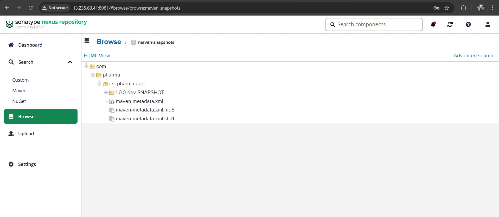
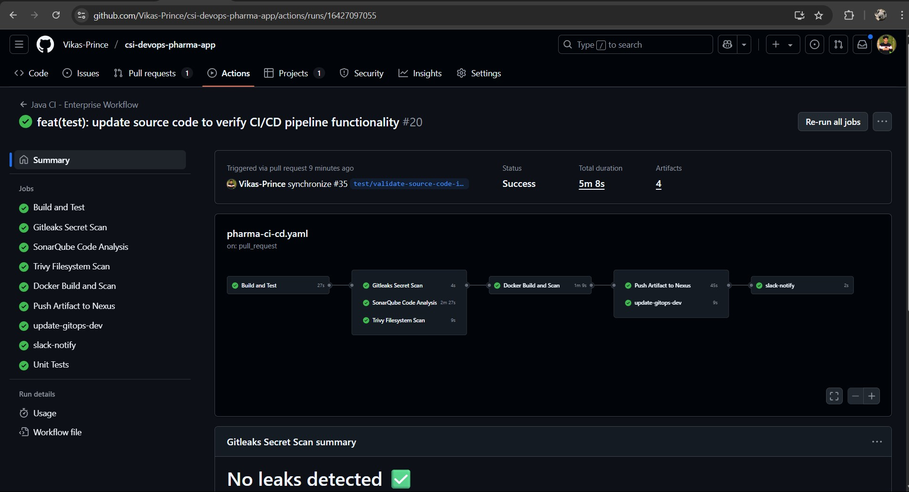

# Java CI - Enterprise Workflow: Step-by-Step Implementation Guide

This document provides a comprehensive, step-by-step walkthrough of the "Java CI - Enterprise Workflow" GitHub Actions pipeline. It outlines the configuration, execution, and expected outcomes at each stage, demonstrating a robust Continuous Integration and Continuous Delivery (CI/CD) process from development to production.

## Pipeline Overview

The "Java CI - Enterprise Workflow" is a sophisticated GitHub Actions pipeline designed for Java applications. It triggers on pull requests to the develop branch, ensuring that all code changes undergo rigorous quality checks, security scans, and deployment processes before reaching production.

**Workflow Trigger:**

The pipeline is initiated when a `pull_request` event occurs on the `develop` branch and changes are detected within the `src/**`, `pom.xml`, `Dockerfile`, `scripts/**`, or `config/**` paths.

```yaml
name: Java CI - Enterprise Workflow

on:
  pull_request:
    branches:
      - develop
    paths:
      - 'src/**'            
      - 'pom.xml'
      - 'Dockerfile'           
      - 'scripts/**'        
      - 'config/**'

permissions:
  checks: write
  contents: read
  
```

### Step 1. Initial Setup and Triggering the Pipeline

To begin, I simulated a typical developer workflow to trigger this CI pipeline. Here's how I did it:

#### Step 1.1: Clone the Repository and Pull Changes

I started by cloning the repository locally and ensuring I had the latest updates from the `develop` branch.

```bash
git clone https://github.com/your-org/your-repo.git
cd your-repo
git checkout develop
git pull origin develop
```

This ensured that I was working on the latest version of the code and had all the recent updates from the development team.

#### Step 1.2: Created a Test Branch

To isolate my changes and test the CI pipeline independently, I created a new feature branch called `test/validate-source-code-integrity`.

```bash
git checkout -b test/validate-source-code-integrity
```

This step ensures that I don’t mess with the main develop branch until I’m sure everything is working fine in my own isolated environment.

#### Step 1.3: Modify Source Code

At this point, I made some changes to the source code. These were intentionally crafted errors to simulate real-world issues like violating coding standards, adding bugs, and reducing unit test coverage. This allowed me to test how well the pipeline would catch these errors and handle the build process.

#### Step 1.4: Commit and Push to Remote Repository

After modifying the code, I committed my changes and pushed them to the remote repository:

```bash
git add .
git commit -m "feat: Introduce changes for pipeline testing"
git push origin test/validate-source-code-integrity
```
This action pushed my local changes to GitHub and set the stage for triggering the pull request.


#### Step 1.5: Raise a Pull Request

Finally, I created a Pull Request (PR) to merge my changes from the `test/validate-source-code-integrity` branch into `develop`. This is the actual trigger for the CI pipeline to start running.


---


### Step 2. Build and Test Stage

Once the PR was raised, the first job that kicked off was the build-and-test job. This stage ensures that the code compiles successfully, passes unit tests, and meets basic quality standards.
The build-and-test job performs several key actions:


- **Checkout Code:** It uses `actions/checkout@v4` to fetch the code from the PR.
  
- **Set Up JDK 17:** The pipeline configures Java 17 using `actions/setup-java@v4` to ensure compatibility with the project.
  
- **Run Static Lint Checks:** I integrated Checkstyle (`mvn checkstyle:check`) to analyze the code for style violations. Since I had intentionally introduced violations, the build didn’t pass immediately, but the process was invaluable for catching issues early.
  
- **Run Unit Tests:** The pipeline then ran `mvn clean install`, compiling the project and executing the unit tests. These tests provided crucial feedback on the correctness of the application.

Once the build process completed, I uploaded the following artifacts for review:
- **Checkstyle Report:** I uploaded the Checkstyle results so that any code style violations could be easily reviewed.
- **JUnit Test Reports:** The unit test results were uploaded for visibility into test failures.


- Stage Successfully Completed and pipeline moved to next stages


### Step 3. Security Scanning Stage (Parallel Stages)

Following the successful build and test, the pipeline proceeds with security scans to identify potential vulnerabilities and hardcoded secrets.

#### 3.1: gitleaks-scan Job Configuration
This job is dedicated to scanning the repository for hardcoded secrets using Gitleaks.

- A fresh checkout of the source code is performed for Gitleaks, with fetch-depth: 0 to ensure a full history for comprehensive scanning.

- Pipeline ran the Gitleaks scanner, which checks for hardcoded secrets (like passwords, API keys, etc.) in the repository. The scan came back clean in this case, so it moved on to the next step.


#### 3.2: trivy-fs-scan Job Configuration

The Trivy scan checks for vulnerabilities in dependencies, which could potentially introduce security risks into the application. I configured it to scan for high-severity and critical vulnerabilities. Fortunately, the scan reported no issues in this case, and I was able to proceed with the next stages.


---


### 4. Code Quality Analysis Stage

This stage focuses on static code analysis using SonarQube to enforce code quality standards and track metrics like code coverage.

- This job integrates with SonarQube to perform comprehensive code analysis.
- The mvn clean verify sonar:sonar command initiates the SonarQube analysis, sending code metrics to the SonarQube server.
- Run SonarQube Scan with Quality Gate Check (Initial Failure) 🔴
- Crucially, the SonarSource/sonarqube-scan-action@v2 action with -Dsonar.qualitygate.wait=true enforces the SonarQube Quality Gates.


- This code initially has many bugs just avoid right now because i developed this application so here my focus is more deployment part so that's why here is a low code coverage (39% vs. 85% required) . This will cause the Quality Gate to fail, and the pipeline will terminate at this point.

The pipeline stops here.


A Jira ticket/work item/issue would typically be raised to the development team for remediation. The developer would fix the issues, create a new PR, and re-trigger the pipeline.

#### Bypassing Sonar Quality Gates (For Testing Only)

For the purpose of this demonstration and for the testing purpose i developed this application So, I will temporarily bypass the SonarQube Quality Gates. This is NOT recommended for production environments but allows us to proceed with the pipeline's subsequent stages for testing.


Now that the SonarQube stage has passed (either by fixing issues or by bypass), the pipeline will proceed to the next stages.

---

### Step 5: Docker Build and Scan Stage

Once the SonarQube checks were bypassed (for testing purposes), the next logical step was to build the Docker image and scan it for vulnerabilities.

#### 5.1: Docker Build and Scan Configuration

- **Docker Image Build:** The Docker image was built using the `Dockerfile` from the repository. I also made sure to cache Docker layers to optimize build times.
  
- **Trivy Scan:** The freshly built Docker image was then scanned with Trivy for vulnerabilities, and the report was saved for later review. This scan was particularly important because we need to ensure no high or critical vulnerabilities make it into production.

#### 5.2: Push Docker Image to GHCR

Once the image was scanned and cleared, I pushed it to GitHub Container Registry (GHCR). The dynamic tagging based on the commit SHA ensured that the image was traceable and tied to the specific commit that triggered the build.


This stage is also successfully passed and ahead to next stages


---

### Step 6: Artifact Management Stage

Next, I focused on managing the application’s artifacts and ensuring they were properly stored and deployed. The Nexus repository is commonly used for managing Java artifacts like JARs.

#### 6.1: Push Artifact to Nexus

The pipeline used `mvn clean package` to build the JAR artifact and then deployed it to the Nexus repository. This ensured that the artifact was versioned and available for future use in staging, QA, and production environments.



This stage is also succuessfully passed 


---

### Step 7: GitOps Deployment to Dev

At this point, I wanted to ensure that the code is deployed in the development environment automatically.

#### 7.1: Update GitOps Repo for Dev

I cloned the GitOps repository and updated the Docker image tag for the development environment. This involved making changes to the `rollout-patch.yaml` file under the `environments/dev` directory to point to the newly built Docker image. Here's the process I followed:

1. **Clone GitOps Repository:** I pulled the latest version of the GitOps repository to ensure I was working with up-to-date configurations.

```bash
git clone https://github.com/your-org/gitops-repo.git
cd gitops-repo
git checkout main
```

2. **Update Docker Image Tag:** I updated the `rollout-patch.yaml` file with the new image tag (using the commit SHA of the newly built Docker image).

```bash
sed -i 's|image: your-image:old-tag|image: your-image:new-tag|' environments/dev/rollout-patch.yaml
```

3. **Commit and Push Changes:** After updating the tag, I committed the changes to the GitOps repository and pushed them.

```bash
git add .
git commit -m "chore: update Docker image tag for dev environment"
git push origin main
```


#### 7.2: Create PR for GitOps Repository

Next, I used the GitHub Action `peter-evans/create-pull-request@v5` to automate the creation of a pull request from the updated GitOps repository branch to the main branch. This PR would trigger ArgoCD to deploy the new version of the application in the development environment once merged.

The PR contained the updated `rollout-patch.yaml` with the new Docker image tag, ensuring that ArgoCD would detect the change and trigger a deployment to the development Kubernetes cluster.


**Outcome:** Once the PR was created and merged, ArgoCD automatically detected the change and deployed the updated image to the dev environment.


---

### Step 8: Slack Notification Stage

As soon as the deployment process is complete, I configured the pipeline to send a Slack notification. This step helps keep the development team informed about the pipeline's progress and whether any issues occurred.

#### 8.1: Slack Notification Job Configuration

In this step, I used the Slack API to send a notification summarizing the outcome of the entire pipeline. I set up a message that dynamically included key details like:

* Pipeline status (success/failure)
* Commit message
* Links to the generated reports (Checkstyle, JUnit, Trivy, etc.)
* Links to the PR and build logs


This job was configured to run after all stages of the pipeline completed, so the team would get real-time updates on the status of the deployment.


With the successful execution of the main Java integration pipeline, including static analysis, security scans, Docker build, artifact management, and GitOps deployment to the Development environment, the validated changes are now ready to be merged.



The next critical step is to merge this code into the develop branch, which will automatically trigger the pipeline for deployment and validation in the **

---

### Step 9: Promote to QA

After successfully validating the code in the development environment, the next logical step is to promote the changes to the QA environment for further validation and testing.

Since we're directly working with the `develop` branch and there’s no need for a manual merge, the process is automated as follows:

#### 9.1: Trigger QA Pipeline from Develop Branch

#### Pipeline Triggered on Changes in Develop:
As soon as changes are pushed to the `develop` branch, the pipeline automatically triggers for QA.

The GitHub Actions pipeline configuration ensures that the deployment to QA is driven by updates made in the `develop` branch.

#### Build and Deploy to QA:

- **Docker Image Build:** The pipeline begins by building a new Docker image for the code, reflecting the latest changes from `develop`.
  
- **Security Scans:** The pipeline runs security scans (such as Trivy) to ensure that no vulnerabilities are present in the new image.

- **Image push to DockerHub:** Pipeline pushed it to DockerHub Container Registry (GHCR). The dynamic tagging based on the commit SHA ensured that the image was traceable and tied to the specific commit that triggered the build.


  
- **Update GitOps Repo for QA:** Once the Docker image is built and validated, the pipeline updates the GitOps repository with the new image tag, so it points to the latest build.


  
- **Slack Notification:** Once the deployment to QA is completed successfully, a Slack notification is sent to the team to inform them about the new deployment.


---

### Step 10: Merge Code to Release Branch
After confirming that everything was functioning as expected in the QA environment, I proceeded to merge the code into the release branch. This was an important step because release is the branch that typically holds stable code that's ready for the next stages of testing, such as staging and eventually production.

#### 10.1: Merge Code to Release
To proceed with the next step, I merged the changes from the `develop` branch to the `release` branch:

```bash
git checkout release
git merge develop
git push origin release
```

This `merge to release` ensures that all the changes tested in `QA` are now part of the `release` branch, which is then prepared for the `staging` deployment.

---
